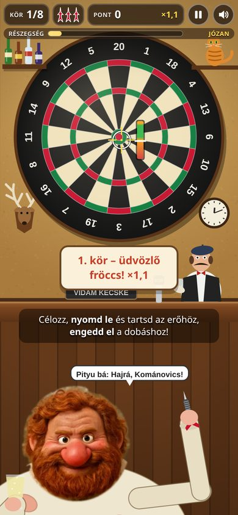
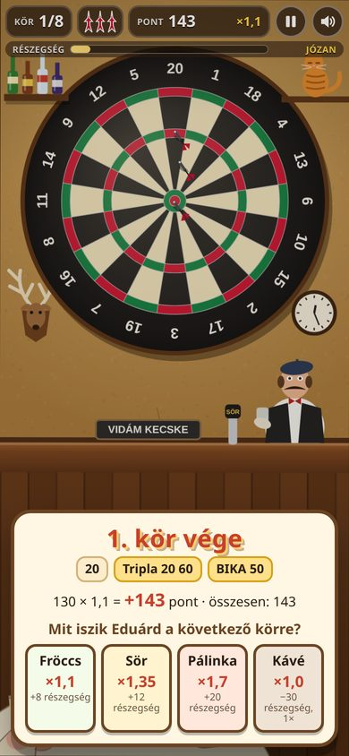
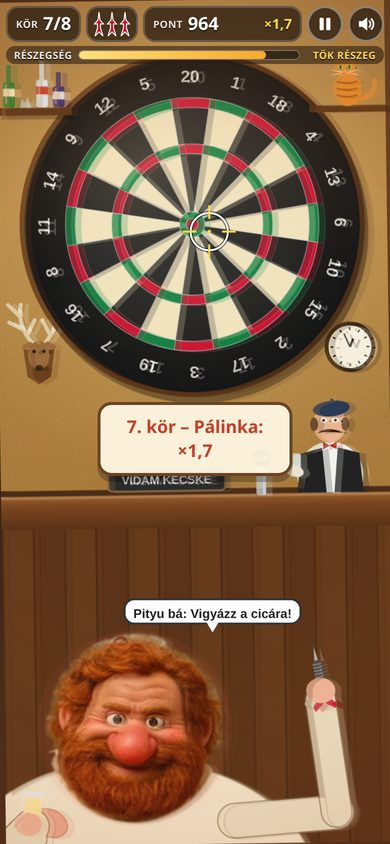
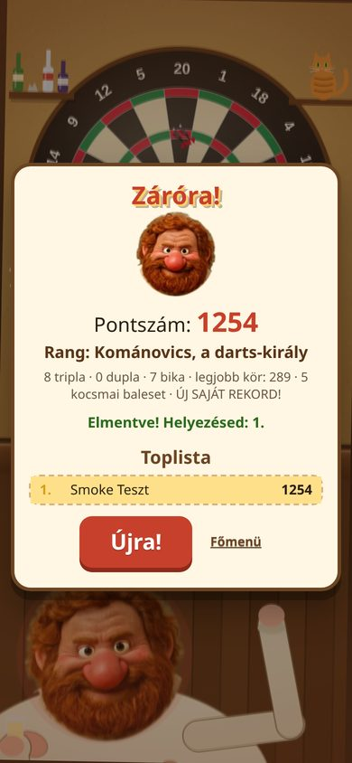

# KOMÁNOVICS Darts

Kocsmai darts **Kománovics Eduárddal** a falusi *Vidám Kecske* kocsmában. Minden kör (3 nyíl) után
Eduárd iszik: minél erősebb az ital, annál nagyobb a következő kör pontszorzója – de annál jobban remeg
a keze, annál lassabban követi a célkereszt, és annál gyakrabban csuklik. Kockázat és jutalom, fröccsel,
sörrel, pálinkával. Böngészőben fut, mobilon és asztali gépen is; online top-10 ranglistával.

- **Élő változat:** https://komanovics-darts.onrender.com
- **Repo:** https://github.com/zsirafmix/komanovics-darts
- Testvérjáték: [KOMÁNOVICS](https://github.com/zsirafmix/komanovics) (ugyanaz a karakter, ugyanaz a fej-kivágás).

| Célzás + erőmérő | Kör vége, italválasztás | Részegen (dupla látás) | Záróra |
|---|---|---|---|
|  |  |  |  |

## Játékmenet röviden
- **Célzás:** egér / ujj (érintésnél a célkereszt az ujj *fölött* van, hogy ne takarja) / nyilak.
  A célkereszt remeg és késve követ – részegen sokkal jobban. Részegen időnként **csuklás** rántja el.
- **Dobás:** nyomd le és tartsd → az erőmérő ingázik; a **zöld sávban** engedd el (Szóköz is jó).
  Gyenge dobás lejjebb esik, túl erős feljebb száll.
- **Pontozás:** szabályos darts-tábla – szimpla, dupla, tripla, bika 25/50 (a dupla/tripla gyűrű
  „kocsmai” módon kicsit szélesebb). **8 kör × 3 nyíl.** Három tripla 20 = „SZÁZNYOLCVAN!”.
- **Italok kör végén:** fröccs (×1,1, +8 részegség), sör (×1,35, +12), pálinka (×1,7, +20),
  kávé (×1,0, −30, játékonként egyszer). Körönként 4 egységet magától józanodik.
- **Kocsmai balesetek:** Feri, a csapos sapkája (büntetőfeles: +8 részegség), Cirmi, a cica
  (nem sérül, csak elugrik), üvegek a polcon (−15), az agancs (+10 vadászbónusz), a falióra
  (megáll az idő), a pult és a fal.
- Szintetizált hangok (Web Audio): nyílbecsapódás, csuklás, koccintás, kocsmai ováció, mulatós
  háttérzene. Némítás: **M** (megjegyzi). Szünet: **P / Esc**. Italválasztás billentyűvel: **1–4**.

## Gyors indítás
```bash
nvm use            # Node 20 (.nvmrc)
npm install
npm start          # http://localhost:3000  (DATABASE_URL nélkül memóriabeli ranglista)
npm test           # unit + API tesztek (node:test)
npm run smoke      # headless Chrome végigjátszás + képernyőképek (CHROME_PATH, SCREENSHOT_DIR)
npm run balance    # ital-egyensúly szimuláció (fejlesztői eszköz)
```
Részletek: [docs/SETUP.md](docs/SETUP.md).

## Technológia
- Frontend: sima HTML + Canvas 2D + ES modulok, build-lépés nélkül (`public/`).
- Backend: Node.js 20 + Express (`server/`), toplista REST API validálással és IP-alapú rate limittel.
- Tárolás: PostgreSQL (`DATABASE_URL`), saját táblában (**`darts_scores`**, `SCORES_TABLE`-lel
  felülírható), hogy több Kománovics-játék osztozhasson **egy** adatbázison; DB nélkül memória-fallback.
- Hosting: Render free web service (`komanovics-darts`, Frankfurt).

## Dokumentáció
- [AGENTS.md](AGENTS.md) – állapot és teendők a következő (AI) fejlesztőnek, **ezzel kezdj**
- [docs/ARCHITECTURE.md](docs/ARCHITECTURE.md) – felépítés, adatfolyam, közös adatbázis terve
- [docs/SETUP.md](docs/SETUP.md) – telepítés, futtatás, deploy
- [docs/TROUBLESHOOTING.md](docs/TROUBLESHOOTING.md) – hibaelhárítás, sikertelen próbálkozások
- [docs/KNOWN_ISSUES.md](docs/KNOWN_ISSUES.md) – ismert hibák, korlátok
- [docs/ROADMAP.md](docs/ROADMAP.md) – következő lépések
- [docs/HANDOFF.md](docs/HANDOFF.md) – legutóbbi munkamenet átadása
- [CHANGELOG.md](CHANGELOG.md)

## API
| Végpont | Leírás |
|---|---|
| `GET /healthz` | `{ok, game, storage, table, time}` – 503, ha a DB nem válaszol |
| `GET /api/scores` | top 10: `{storage, scores:[{name, score, level, created_at}]}` |
| `POST /api/scores` | `{name, score, level, durationSec}` → `201 {id, rank, name, score, scores}`; 400 hibás / hihetetlen adat, 429 rate limit |

A pontszámot a kliens számolja – a szerver csak durva hihetőségi szűrést végez (lásd KNOWN_ISSUES).
