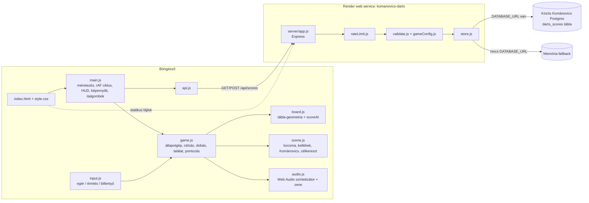
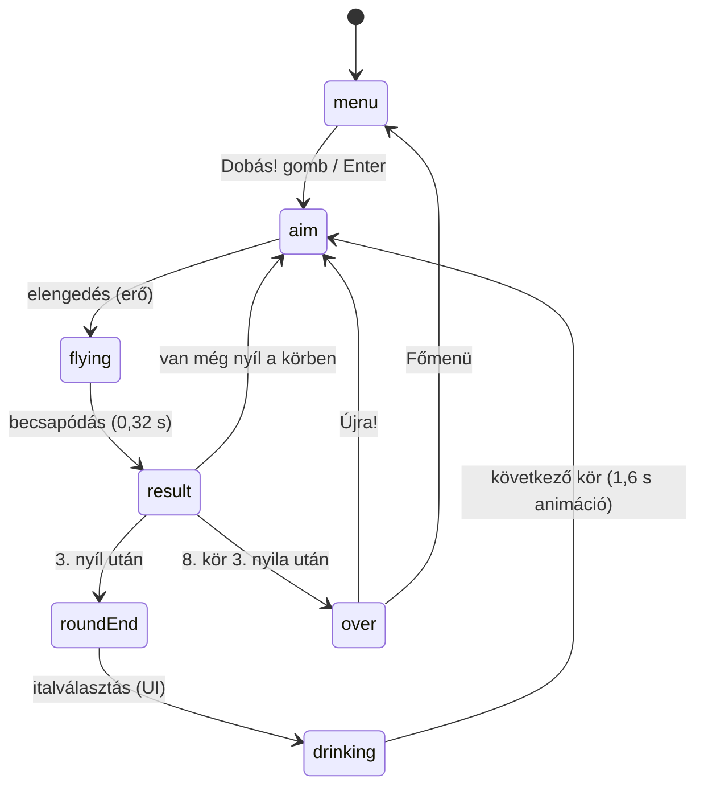
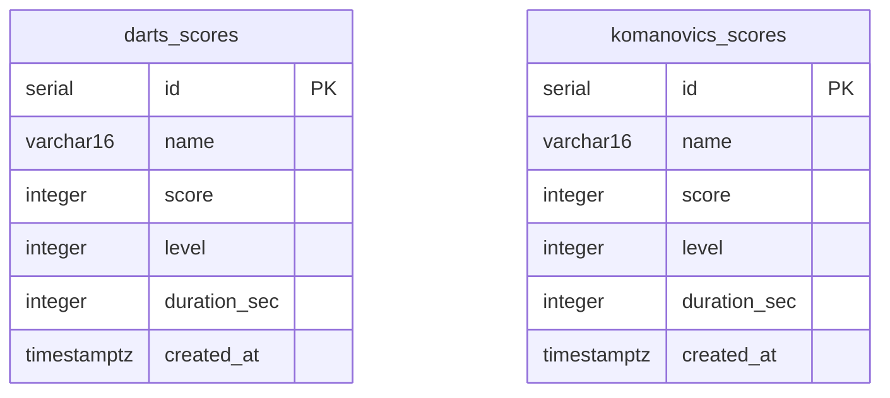

# Architektúra – KOMÁNOVICS Darts

## 1. Áttekintés
Egyetlen Node.js (Express) folyamat szolgálja ki a build-lépés nélküli HTML/Canvas/ES-modul frontendet
és a toplista REST API-t. A pontszámok PostgreSQL-ben tárolódnak (`DATABASE_URL`) egy **játék-specifikus
táblában** (`darts_scores`), ennek hiányában memóriában (újraindításkor elvesznek).



## 2. Frontend (`public/`)

### Modulok
| Fájl | Felelősség |
|---|---|
| `js/config.js` | Állandók: logikai szélesség `W=400`, 8 kör × 3 nyíl, kezdő részegség 10, körönkénti józanodás 4, italok (`DRINKS`), remegés/késés/erőmérő paraméterek. |
| `js/board.js` | Tábla-geometria mm-ben (`RING`, `ORDER`), `scoreAt(dx, dy, s)` → `{points, label, ring, num}` vagy `null` (táblán kívül), `drawBoard`. |
| `js/scene.js` | `computeLayout(H)` (minden elem pozíciója a képernyő-magasságból), előrenderelt háttér (fal, lámpa, agancs, pult, csap, „VIDÁM KECSKE” tábla, darts-tábla), kellékek (polc üvegekkel, óra, Cirmi, Feri), Kománovics (fej-kivágás + rajzolt test/karok/ital), célkereszt, erőmérő, buborék. |
| `js/game.js` | `Game` osztály: állapotgép, célzás, dobás, találat-feloldás, pontozás, ital, rajzolás (dupla látás). |
| `js/input.js` | Pointer Events (egér + érintés, `setPointerCapture`), billentyűk; logikai koordinátába vált: `(clientX − rect.left) · W / rect.width`. |
| `js/audio.js` | `Sound`: minden hang szintetizált (oszcillátor + zaj + szűrők), 3/4-es mulatós keringő (harmonika + cimbalom-szerű pengetés) és kocsmai alapzaj; némítás `localStorage` `kd_muted`. |
| `js/main.js` | Vászon méretezése (DPR ≤ 2), `requestAnimationFrame` ciklus, HUD, képernyők, italgombok (feliratuk a `config.js`-ből), ranglista, `window.__KD` teszt-hook. |
| `js/api.js`, `js/util.js` | Ranglista-hívások; segédfüggvények (clamp, lerp, noise1…). |

### Állapotgép

A `paused` jelző minden játékállapotot megállít (P / Esc / szünet gomb / tab elrejtése).

### Célzás és dobás
1. **Célpont** = egér / ujj − 70 logikai px (érintésnél) / nyilakkal mozgatott pont.
2. **Késleltetett követés:** aluláteresztő szűrő, időállandó `0,03 + részegség × 0,0035` s (100-nál ~0,38 s).
3. **Remegés:** szinuszok + 1D zaj összege, amplitúdó `3 + részegség × 0,55` px, a fázis részegen gyorsabban fut.
4. **Csuklás:** 20 részegség fölött 3–8 mp-enként (részegen sűrűbben) véletlen irányú rántás `14 + részegség × 0,35` px, „hukk!”.
5. **Erőmérő:** nyomva tartáskor `(1 − cos)/2` szerint ingázik, periódus `1,3 / (1 + részegség/200)` s.
   A `0,58–0,88` sávon kívül függőleges hiba: gyenge → lejjebb (max 110 px), túl erős → feljebb (max ~50 px).
6. **Szórás:** Gauss-közelítés, szórás `1,5 + részegség × 0,06` px. A nyíl 0,32 s alatt ívben repül a kézből.

### Találat-feloldás (sorrend számít)
1. Tábla (`scoreAt`) → pont; bika/tripla 20 ováció, „Mellé” = a tábla szélére (0 pont).
2. Polc, ha még ép → üvegtörés, −15 bónusz.
3. Cirmi (ha ott ül) → elugrik, a nyíl a polcba áll mellette (a cica **soha** nem sérül), 2 kör múlva visszajön.
4. Agancs → +10 bónusz. 5. Óra → megáll és megbillen. 6. Feri (ha még nincs nyíl a sapkájában) → sapkájába áll, +8 részegség (büntetőfeles).
7. Pult (a pult teteje alatt) → „A pultba!”. 8. Egyébként fal → „A falba!”, vakolatpor.

### Pontozás
`kör pont = round(táblapontok összege × aktuális szorzó) + bónuszok` (az összpontszám nem mehet 0 alá).
Az 1. kör szorzója az „üdvözlő fröccs” (×1,1); a további körökét az előző kör végén választott ital adja.

| Ital | Részegség | Szorzó | Megjegyzés |
|---|---|---|---|
| Fröccs | +8 | ×1,1 | |
| Sör | +12 | ×1,35 | |
| Pálinka | +20 | ×1,7 | |
| Kávé | −30 | ×1,0 | játékonként egyszer |
Ivás után −4 józanodás, a részegség 0–100 közé szorítva. Hangolás: `npm run balance` – pontos célzásnál
a három ital mediánja közel azonos (~650–700), pontatlanabbnál az erősebb ital nyer, nagyobb szórással.

## 3. Szerver (`server/`)
- **`index.js`** – `createStore(process.env, {defaultTable: GAME.defaultTable})` → `init()` (5 próbálkozás 3 mp-enként; ha mind elbukik → memória-fallback, a táblanév megmarad), `createApp()`, `listen(PORT, '0.0.0.0')`, SIGTERM/SIGINT kezelés.
- **`gameConfig.js`** – a játék-specifikus beállítások egy helyen: név, alapértelmezett tábla (`darts_scores`), validálási határok.
- **`app.js`** – `trust proxy = 1`, biztonsági fejlécek (CSP: `script-src 'self'`), `GET /healthz`, `GET/POST /api/scores`, 404/400/413 JSON hibák, statikus fájlok (`no-cache` a kódra).
- **`validate.js`** – `sanitizeName` (NFC, csak betű/szám/szóköz és `._-!?`, max 16), `validateScore(body, limits)`.
  Darts határok: pontszám egész 0..5000, `level` (= lejátszott körök) 1..8, `durationSec` kötelező, 0..7200,
  hihetőség: `score ≤ 100 + durationSec × 90` (egy valódi játék ≥ ~45 mp, az elméleti maximum ~2450 pont).
- **`rateLimit.js`** – IP-nkénti 60 mp-es ablak, alapértelmezés 5 POST/perc, 429 + `Retry-After`.
- **`store.js`** – memória és Postgres implementáció azonos interfésszel (`kind`, `table`, `init`, `top`, `add`, `health`, `close`).
  A táblanevet `assertTableName` ellenőrzi (`^[a-z_][a-z0-9_]{0,62}$`), mert SQL-be interpolálódik (paraméterként nem adható át).

## 4. Közös Kománovics-adatbázis (tervezett)
Render workspace-enként csak **egy** ingyenes Postgres lehet, ezért a Kománovics-játékok egyetlen
adatbázison osztoznak, **játékonként külön táblában**:



```sql
CREATE TABLE IF NOT EXISTS darts_scores (
  id           SERIAL PRIMARY KEY,
  name         VARCHAR(16) NOT NULL,
  score        INTEGER NOT NULL CHECK (score >= 0 AND score <= 1000000),
  level        INTEGER NOT NULL DEFAULT 1,
  duration_sec INTEGER,
  created_at   TIMESTAMPTZ NOT NULL DEFAULT now()
);
CREATE INDEX IF NOT EXISTS darts_scores_score_idx ON darts_scores (score DESC, created_at ASC);
```
- A tábla induláskor automatikusan létrejön (`CREATE TABLE IF NOT EXISTS`), migrációs eszköz nincs.
- Minden játék ugyanazt a `DATABASE_URL`-t kapja, és a saját `SCORES_TABLE`-jét (vagy a kódbeli alapértelmezést) használja.
- Az index neve is táblanév-előtagos (`<tábla>_score_idx`), így nincs névütközés.
- Rangsor: `score DESC, created_at ASC, id ASC` (döntetlennél a korábbi nyer).

## 5. Hosting
Render free web service `komanovics-darts` (Frankfurt), build `npm install`, start `npm start`,
`NODE_VERSION=20`, `SCORES_TABLE=darts_scores`, `SCORE_RATE_LIMIT_PER_MIN=5`. Adatbázis nincs csatolva
(lásd KNOWN_ISSUES KI-1). A GitHub-push nem indít automatikus deployt (a Render GitHub App nem fér hozzá
a repóhoz) – deployt kézzel / MCP `trigger_deploy`-jal kell indítani.
